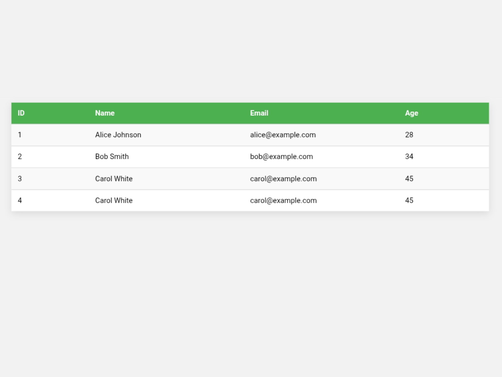

# 📋 HTML & CSS Table Layout

This project showcases a custom **table layout** built using **HTML and CSS only**, without relying on native `<table>` elements or JavaScript. Instead, it leverages **CSS Flexbox** and **CSS Grid** to achieve a clean, responsive, and flexible design.

---

## 🎯 Objective

The goal of this project is to demonstrate a modern approach to table design that offers:

- Easier layout control and customization
- Improved responsiveness
- A cleaner structure compared to traditional table markup

---

## 🛠️ Technologies Used

- HTML5
- CSS3
  - `display: flex`
  - `display: grid`
  - `grid-template-columns`
  - Responsive design with `@media` queries

---

## ✅ Features

- Fully responsive layout
- Does **not** use native `<table>`, `<thead>`, or `<tr>` tags
- Lightweight and easy to integrate
- Reusable UI component
- Clean and modern design

---

## ⚠️ Note

This is a **demo structure**, meant to showcase layout capabilities using Flexbox and Grid.  
If you plan to use it in a real project:

- **You must define a fixed or responsive width and height** for the table based on your layout needs.
- Use **media queries** to adapt the design for different screen sizes.

---



## 🚀 Getting Started

Clone the repository:

```bash
git clone https://github.com/hassanowner/Table-with-Html-Css.git
```
```
git clone git@github.com:hassanowner/Table-with-Html-Css.git
